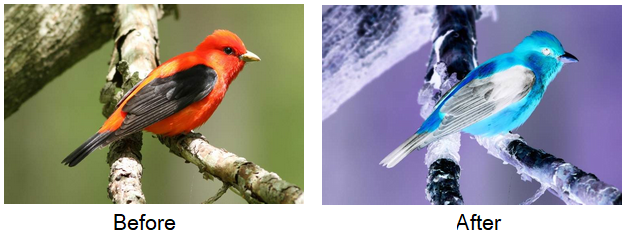

# Basic File I/O in Rust

## Open file and write some data

```rust
use std::fs;
use std::io;
use std::io::{SeekFrom};
use std::io::prelude::*;

fn main() {
    let mut fp = fs::OpenOptions::new()
        .create(true)
        .write(true)
        .open("test.txt")
        .unwrap();
    
    fp.write_all(b"1");
    fp.write_all(b"2");
    fp.write_all(b"3");
    fp.seek(SeekFrom::Start(0));
    fp.write_all(b"4");
    fp.write_all(b"5");
}
```

### Output file (test.txt)

```
453
```

### Points
 - We use `std::fs::OpenOptions` builder class to create `File` (file handle object).
 - `create(true)` mean create new file if not exists
 - `write(true)` to open file with write permission
 - After call `open(filepath)`, the builder class return `Result<File>`, we can handle an error here
 - `write_all` get bytes as input, and write to file.
 - File handle curson will be move after call `write_all`, but we can manually move it by `seek` function (because `File` implement Trait `io::Seek`)
 - `seek` receive parameter `SeekFrom` object in 3 variants
   - Start(u64) : Seek from beginning of file
   - Current(u64) : Seek from current position of `Cursor`
   - End(u64) : Current size of file plus position
 - File handle automatically close after lifetime of file handle object end. (In C/C++ we need to call fclose(FILE *fp) manually)

## Serialize/Deserialize file by JSON

There're a wonderful library called `serde_json`. With this, we can easily/safety serialize/deserialize structure data to text format.

```rust
use serde::{Deserialize, Serialize};
use serde_json::Result;
use std::fs;
use std::io::prelude::*;

#[derive(Debug, Serialize, Deserialize)]
enum Role {
    Attacker,
    Support,
    Tanker
}

#[derive(Debug, Serialize, Deserialize)]
struct Player {
    id: u32,
    name: String,
    role: Role
}

#[derive(Debug, Serialize, Deserialize)]
struct Party {
    name: String,
    members: Vec<Player>
}

fn main() {
    let alice = Player { id: 1, name: "Alice".to_string(), role: Role::Support };
    let bob = Player { id: 2, name: "Bob".to_string(), role: Role::Tanker };
    let prim = Player { id: 3, name: "Primula".to_string(), role: Role::Attacker };

    let x = Party { name: "For Fun".to_string(), members: vec!(alice, bob, prim) };

    let json = serde_json::to_string(&x).unwrap();
    println!("{}", json);
    println!();

    {
        let mut fp = fs::OpenOptions::new()
            .create(true)
            .write(true)
            .open("party.json")
            .unwrap();
    
        fp.write_all(json.as_bytes());
    }

    let mut fp = fs::OpenOptions::new()
        .read(true)
        .open("party.json")
        .unwrap();
    
    let mut buffer = String::new();
    fp.read_to_string(&mut buffer);

    let x_ds: Party = serde_json::from_str(&buffer).unwrap();
    println!("{:?}", x_ds);
}
```

### Points
 - We use `serde_json::to_string(&str)` to encode struct to JSON, in the same way, we use `serde_json::from_str(&str)` to decode JSON back to struct.
 - To make struct serializable with serde, we need to derive macro call `Serialize` and `Deserialize` if we wish to deserialize.

## Binary File with Rust

To save struct with Binary-Encoded in Rust this can be done by using library called `bincode` combo with `serde`'s macro. we migrate our last code like this:

```rust
use serde::{Deserialize, Serialize};
use std::fs;
use std::io::prelude::*;
use std::io::SeekFrom;

#[derive(Debug, Serialize, Deserialize)]
enum Role {
    Attacker,
    Support,
    Tanker
}

#[derive(Debug, Serialize, Deserialize)]
struct Player {
    id: u32,
    name: String,
    role: Role,
    money: u32
}

#[derive(Debug, Serialize, Deserialize)]
struct Party {
    name: String,
    members: Vec<Player>
}

fn main() {
    let alice = Player { id: 10, name: "Alice".to_string(), role: Role::Support, money: 10 };
    let bob = Player { id: 1000, name: "Bob".to_string(), role: Role::Tanker, money: 255 };
    let prim = Player { id: 100000, name: "Primula".to_string(), role: Role::Attacker, money: 1000 };

    let x = Party { name: "For Fun".to_string(), members: vec!(alice, bob, prim) };

    let bin = bincode::serialize(&x).unwrap();
    println!("{:?}", bin);
    println!();

    let mut fp = fs::OpenOptions::new()
        .create(true)
        .write(true)
        .open("party.dat")
        .unwrap();

    fp.write_all(&bin);
}
```

### Points
 - Because the output file `party.dat` is binary file, we cannot open normally by Text Editor (Truly, we can open but it may display badly / missing plenty of information)
 - To properly open binary file, we use `Hex Editor`. there's many free stuffs:
   - [HxD](https://mh-nexus.de/en/hxd/)
   - [Online Hex Editor](https://hexed.it/)

### Understanding Binary Encoding

Let's dig more deeper on the result `bincode` serialization.


For who may not familiar with hex editor, the two numbers in each columns represent one byte in file (in Haxadecimal). Let's see our serialized struct `Party` again.

```rust
struct Party {
    name: String,
    members: Vec<Player>
}
```

And let's compare with the first 15 bytes for file
```
07 00 00 00 00 00 00 00 46 6F 72 20 46 75 6E
```

the part `46 6F 72 20 46 75 6E` in each bytes represent ASCII number of String 'For Fun'. and the front 8 bytes, is represent the length of this String. Someone may ask why use 8 bytes to store, it might be Rust (or bincode) use `u64` data format to store the lenght of string. (00 00 00 00 00 00 00 07 is 7 in decimal format)

Another interesting, why it's in reversed order!! The reason is bincode respect to machine's `Memory Layout`, it's use the same way that `u64` store in RAM.

Ok, let's see for next 8 bytes. It's `u64` again. By using method above, we got 

03 00 00 00 00 00 00 00 ---> 3 (decimal)

This is the size of `Party.members` vector, `bincode` store the size of vector before the real vector's content.

Now, we have familiar to Binary File, so let's take more quickly. The first item in vector is struct with data:

```rust
Player { 
    id: 10,      // u32
    name: "Alice".to_string(),      // lenght = 5
    role: Role::Support,        // u32's Enum (by default)
    money: 10                   // u32
}
```

And here how stored in Hex form:


```
0x0000000A = 10             ; id
0x0000000000000005 = 5      ; String.len()
0x416C696365 = 'Alice'      ;
0x00000001 = 1              ; Role::Support
0x0000000A = 10             ; money
```

I will leave the rest of data for you to practice.

## Cautions about using binary file

Binary file is small, and in most case it's run faster than Json Serialization but there's cautions
 - Binary file is hard to read by human and cannot modify by text editor.
 - If we change the structure of data, we can no longer use the saved file (without conversion or tweak logic). for example
   - Swap the order of struct's member
   - Change the size of struct's member
 - It's lack of universal(no standard) comparing to JSON.

# Homework (Playing with BMP File)

Let's create `inverse` filter for `Bitmap File` (.bmp) by using Binary File I/O. 

Your program read input bmp file, and create output bmp file which apply inverse filter.



The Bitmap file is one of uncompressed image format. In this case we use normal `24-bit RGB` image.
The File header(the beginning of file) of BMP File is 14 bytes long with this information

```rust
{
    // MagicNumber: 2 bytes
    // FileSize: 4 bytes
    // Reserved: 4 bytes (not important)
    // StartAddress: 4 bytes
}
```

two important values in here are `FileSize` and `StartAddress`.

`FileSize` is the size of BMP File on disk, `StartAddress` is the start address of pixel data.

if you use hex editor to see the content at `StartAddress`, you will see each pixel data store in this pattern:

```
[blue: u8] [green: u8] [red: u8] ....
```

The color in each RGB channel is stored in reverse order. And the byte order is from last row of pixels to first row of pixel. (Anyway, this is not important for this quiz)

To create inverse filter, we have to inverse bit of pixel data in every bytes. (0 to 1, 1 to 0)

In rust, we can use operator `!` 

```rust
let mut x: u8 = 254u8;
x = !x              // x is now 1

// 254 (1111 1110) ---> 1 (0000 0001)
```

Ok, I hope you now have enough information to implement this program.

### Hint
 - In this case, we can skip working on Bitmap's DIB part (the content after header and before pixel data), but we still have to copy all of those bytes to output file.
 - You may have to use `seek` function

More information about bitmap, you can look at [wiki](https://en.wikipedia.org/wiki/BMP_file_format)